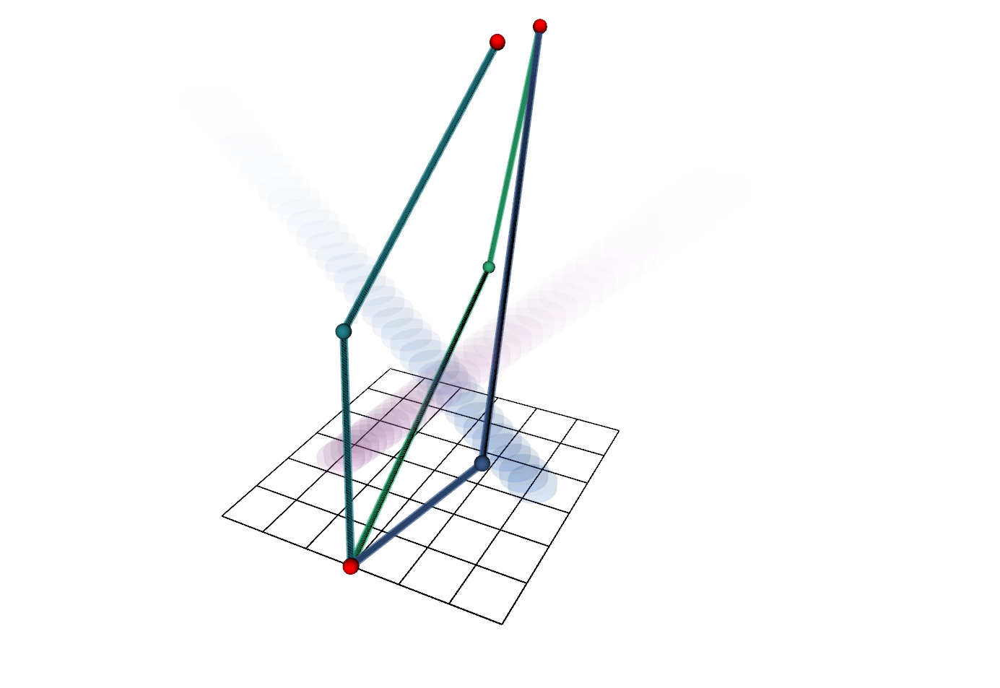

# Guidance Planner 

This repository provides a Visibility-PRM implementation that computes topology distinct trajectories in 2D dynamic environments. The code is associated with the following publications:

O. de Groot, L. Ferranti, D. Gavrila, and J. Alonso-Mora, *Topology-Driven Parallel Trajectory Optimization in Dynamic Environments.* IEEE Transactions on Robotics 2024. Preprint: http://arxiv.org/abs/2401.06021


O. de Groot, L. Ferranti, D. Gavrila, and J. Alonso-Mora, *Globally Guided Trajectory Optimization in Dynamic Environments.* IEEE International Conference on Robotics and Automation (ICRA) 2023. Available: https://doi.org/10.1109/ICRA48891.2023.10160379

This guidance planner is the high-level component in Topology-Driven MPC, see `https://github.com/tud-amr/mpc_planner`.



## Table of Contents
1. [Features](#features) 
2. [Installation](#installation) 
3. [Examples](#examples) 
4. [Configuration](#configuration) 
5. [License](#license) 
6. [Citing](#citing)

## Features
This package is a fast C++ implementation of Visibility-PRM with topology comparison. The following topology comparison functions are provided:

- H-signature 
- Winding angles 
- UVD 

For more information on these, see [1].

### Limitations
The package was designed for 2D dynamic environments. Higher dimensional applications may be possible, but are not yet supported.

## Installation
This package supports ROS1 (tested with Noetic) and ROS2 (tested with Humble). To install run:

From `catkin_ws/src/`:

```
git clone https://github.com/tud-amr/guidance_planner.git
git clone https://github.com/oscardegroot/ros_tools.git
```

Install dependencies from your workspace, e.g., `catkin_ws/`:

```
rosdep install --from-paths src --ignore-src -r -y
```

Build with:

```
catkin build guidance_planner
```

## Examples
For a complete example, see `src/ros1_example.cpp`.

To run the example:
```
roslaunch guidance_planner ros1_example.launch
```

This opens RViz and computes several distinct trajectories around some randomized obstacles (see video).


## Configuration
To change planner settings, see `config/params.yaml`. Important settings are:

- `debug/output` - Print debug information if `true`
- `T` - Time horizon
- `N` - Number of time steps
- `sampling/n_samples` - Number of samples in each iteration
- `homotopy/n_paths` - Number of homotopy distinct trajectories to compute
- `homotopy/comparison_function` - Homotopy comparison function to use

For profiling information (i.e., computation times) go to `chrome://tracing/` in google chrome. Then click `load` and select `guidance_planner/profiler.json`. This should show some timings:


## License
This project is licensed under the Apache 2.0 license - see the LICENSE file for details.

### Acknowledgements

## Citing
This repository was developed at the Cognitive Robotics group of Delft University of Technology by [Oscar de Groot](https://github.com/oscardegroot) in partial collaboration with [Dennis Benders](https://github.com/dbenders1) and [Thijs Niesten](https://github.com/thijs83) and under supervision of Dr. Laura Ferranti, Dr. Javier Alonso-Mora and Prof. Dariu Gavrila.

If you found this repository useful, please cite the following paper:

- [1] **Topology-Driven Model Predictive Control (T-MPC)** O. de Groot, L. Ferranti, D. Gavrila, and J. Alonso-Mora, “Topology-Driven Parallel Trajectory Optimization in Dynamic Environments.” arXiv, Jan. 11, 2024. [Online]. Available: http://arxiv.org/abs/2401.06021
