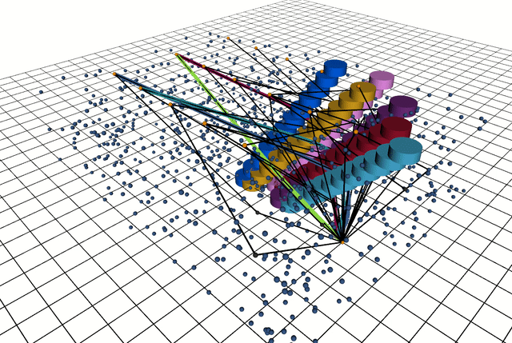
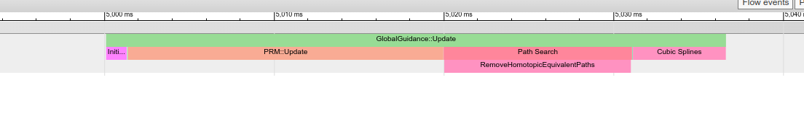

[](https://opensource.org/licenses/Apache-2.0)


# Guidance Planner 

This repository provides a sampling-based global planner implementation that computes topology distinct trajectories in 2D dynamic environments (i.e., each computed trajectory passes the obstacles differently) for motion planning of mobile robots. 

This code is associated with the following publications:

**Journal Paper:** O. de Groot, L. Ferranti, D. M. Gavrila, and J. Alonso-Mora, *Topology-Driven Parallel Trajectory Optimization in Dynamic Environments.* **IEEE Transactions on Robotics (T-RO)** 2024. Available: https://doi.org/10.1109/TRO.2024.3475047


**Conference Paper:** O. de Groot, L. Ferranti, D. M. Gavrila, and J. Alonso-Mora, *Globally Guided Trajectory Optimization in Dynamic Environments.* **IEEE International Conference on Robotics and Automation (ICRA)** 2023. Available: https://doi.org/10.1109/ICRA48891.2023.10160379

This guidance planner is the high-level planning component in Topology-Driven MPC, see `https://github.com/tud-amr/mpc_planner`. A containerized VSCode environment is available at https://github.com/tud-amr/mpc_planner_ws.

---

Standalone example with randomized obstacles |  [T-MPC](https://github.com/tud-amr/mpc_planner)  with `mpc_planner` (`guidance_planner` used as high-level planner) |
| ------------- | ------------- |
|  |  |

---


## Table of Contents
1. [Features](#features) 
2. [Installation](#installation) 
3. [Examples](#examples) 
4. [Configuration](#configuration) 
5. [License](#license) 
6. [Citing](#citing)

## Features
This package is a fast C++ implementation of Visibility-PRM with topology comparison. It takes obstacle predictions, the robot state and a set of goals as input and provides several distinct guidance trajectories as output.

For differentiating trajectories, the following topology comparison functions are implemented:

- H-signature (https://link.springer.com/article/10.1007/s10514-012-9304-1)
- Winding angles (https://link.springer.com/article/10.1023/A:1010979823190)
- UVD (https://ieeexplore.ieee.org/abstract/document/9196996)

For more information on these comparison functions, see Appendix A of [1].

The goals can be configured as a set of 2D points along with their cost or as a reference path in 2D. For more information, see the [examples](#examples).

### Limitations
The package was designed for 2D dynamic environments. Higher dimensional applications may be possible, but are not yet supported.

## Installation
This package supports ROS1 (tested with Noetic) and ROS2 (tested with Humble). To install run:

From `catkin_ws/src/`:

```bash
git clone https://github.com/tud-amr/guidance_planner.git
git clone https://github.com/oscardegroot/ros_tools.git
```

Install dependencies from your workspace, e.g., `catkin_ws/`:

```bash
rosdep install --from-paths src --ignore-src -r -y
```

Build with:

```bash
catkin build guidance_planner
```

## Examples
For a complete example, see `src/ros1_example.cpp`. To run the example:

```bash
roslaunch guidance_planner ros1_example.launch
```

This opens RViz and computes several distinct trajectories around some randomized obstacles (see video).


---

This **visualization** denotes:

- All samples (blue dots)
- The Visibility-PRM graph (black lines and dots)
- Obstacle predictions in 3D (x, y, time) as colored cylinders.
- Smoothed output trajectories (colored 3D lines).

More visuals are available by setting `debug/visuals: true` in `config/params.yaml`.

## Usage
To use this planner in C++, use `#include <guidance_planner/global_guidance.h>` and follow the example in `src/ros1_example.cpp`.

A `ROS1` server is also provided (see `src/learning/guidance_server.cpp`) for usage with Python but is not part of the main code and has not been tested extensively.

## Configuration
To change planner settings, see `config/params.yaml`. Important settings are:

- `debug/output` - Print debug information if `true`
- `T` - Time horizon
- `N` - Number of time steps
- `sampling/n_samples` - Number of samples in each iteration
- `homotopy/n_paths` - Number of homotopy distinct trajectories to compute
- `homotopy/comparison_function` - Homotopy comparison function to use

For profiling information (i.e., computation times) go to `chrome://tracing/` in google chrome. Then click `load` and select `guidance_planner/profiler.json`. This should show some timings:


## License
This project is licensed under the Apache 2.0 license - see the LICENSE file for details.

## Citing
This repository was developed at the Cognitive Robotics group of Delft University of Technology by [Oscar de Groot](https://github.com/oscardegroot) under supervision of Dr. Laura Ferranti, Dr. Javier Alonso-Mora and Prof. Dariu Gavrila.

If you found this repository useful, please cite our paper:

- [1] **Journal Paper:** O. de Groot, L. Ferranti, D. M. Gavrila, and J. Alonso-Mora, *Topology-Driven Parallel Trajectory Optimization in Dynamic Environments.* **IEEE Transactions on Robotics (T-RO)** 2024. Available: https://doi.org/10.1109/TRO.2024.3475047